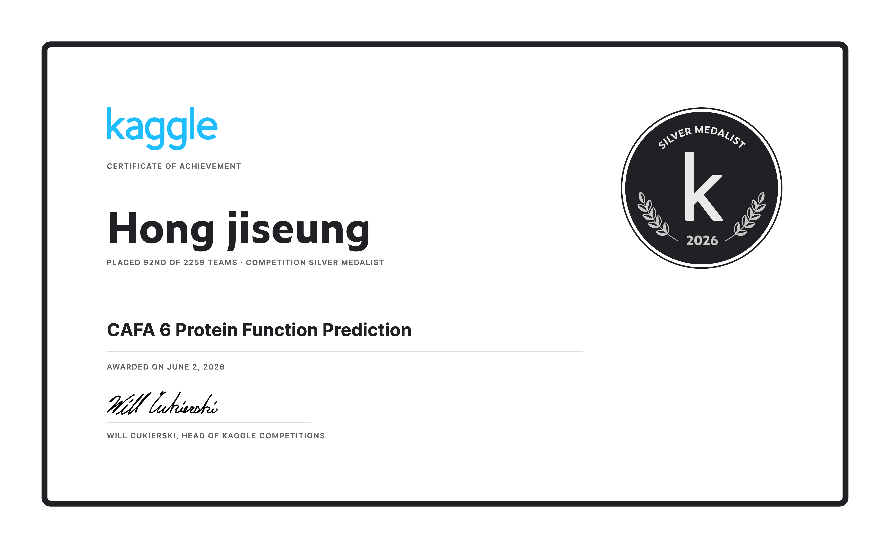

# Taxonomy-Aware ESM2

A protein function prediction model that fuses NCBI taxonomic lineage into ESM2 via cross-attention to predict Gene Ontology (GO) terms. Built for the CAFA challenge.

## 🥈 Result: Kaggle CAFA 6 Silver Medal

Placed **92nd of 2,259 teams** in [CAFA 6 Protein Function Prediction](https://www.kaggle.com/competitions/cafa-6-protein-function-prediction) on Kaggle (awarded June 2, 2026).

<p align="center">
  
</p>

---

## Background

Evolutionary lineage is a meaningful signal for protein function prediction: the same sequence can carry different functions depending on the taxon it belongs to. ESM2 captures the structural features of the sequence itself, while taxonomy tells the model which biological context the sequence comes from. The core problem of this project was how to combine the two naturally.

## My Contribution

I was responsible for GO data collection and curation. I collected GO annotation data from UniProt and built a training-ready dataset by removing obsolete terms and filtering by evidence code. I parsed the GO ontology OBO file to extract 40,122 valid terms and built the label propagation pipeline following the true path rule.

---

## Model Architecture

```
Protein sequence (FASTA)
            │
            ▼
ESM2 backbone (650M, LoRA)  →  Sequence embeddings (B, L, 1280)
                                        │
                                 Cross-Attention  ←  Taxonomy embeddings (B, 7, 1280)
                                        │
                              LayerNorm + Residual
                                        │
                               Masked Mean Pooling
                                        │
                           Linear (→ 40,122 GO terms)
```

ESM2 (`esm2_t33_650M_UR50D`) is fine-tuned with LoRA. Rank-8 adapters are attached only to the Query and Value matrices, reducing the trainable parameters from 650M to about 800K.

The taxonomy encoder has a separate embedding layer (dim=128) for each of the seven ranks: phylum, class, order, family, genus, species, and subspecies. In cross-attention, the sequence serves as the Query and the taxonomy embeddings as the Key/Value, so each sequence position learns how much to attend to each taxonomic rank. Compared with simple concatenation, this lets the model adjust each rank's contribution more flexibly.

## Training

**Loss function**: A combination of Asymmetric Focal Loss and IC weighting. GO labels are highly imbalanced (common terms appear tens of thousands of times, rare terms only dozens), so plain BCE tends to converge on common terms alone. A higher focusing parameter on negatives (`γ_neg=4`) and per-term weights from the information content (IC) values in IA.tsv force the model to learn rare but informative terms.

**Evaluation**: Weighted F-max, the CAFA standard. Thresholds are scanned from 0.01 to 1.0, IC-weighted precision and recall are computed at each, and the point with the highest F1 is reported. The best model under this metric is saved separately from the best validation-loss model.

**Mixed precision**: AMP (`autocast` + `GradScaler`) with FP16 forward passes and FP32 parameter updates.

## Data Preprocessing

The dataset was built by preprocessing three main sources.

**GO data** (`src/build_go_vocab.py`): Obsolete terms were removed from the OBO file, leaving 40,122 valid GO terms. UniProt annotations were curated by evidence code, prioritizing experimentally validated entries. Labels were also propagated to every ancestor of each annotated GO term; implemented with CSR sparse matrices, this stays fast even at 40,122 × 40,122.

**Taxonomy data** (`src/build_taxonomy_vocab.py`, `src/vectorize_species.py`): The NCBI taxonomy dump is parsed to build a vocabulary for each rank (phylum to subspecies), and each TaxID is converted into an array of seven integer indices stored as a lookup table.

**Sequence data**: TaxIDs are parsed from the `OX=` field of FASTA headers, and sequences are truncated to at most 1,024 tokens with the ESM2 tokenizer. Entries without annotations or taxonomy vectors are excluded from training.

---

## Usage

```bash
pip install -r requirements.txt

# Local test (8M model)
python local_train.py

# Full training
python src/train.py \
  --data_path dataset/ \
  --esm_model_name facebook/esm2_t33_650M_UR50D \
  --epochs 20 --batch_size 64 --lr 1e-4 \
  --use_lora True --lora_rank 8 \
  --output_dir outputs

# Experiment tracking
mlflow ui --backend-store-uri sqlite:///src/mlflow.db
```

## Project Structure

```
src/
  model.py                 # TaxonomyAwareESM, AsymmetricLoss
  dataset.py               # ProteinTaxonomyDataset
  train.py                 # Training loop, evaluation, MLflow
  asymmetric_loss.py       # Loss function, IC weights
  build_taxonomy_vocab.py  # Taxonomy vocabulary construction
  vectorize_species.py     # TaxID → integer vector
  build_go_vocab.py        # GO vocabulary construction
  cafa_evaluator_driver.py # CAFA evaluation
  CAFA-evaluator-PK/       # Official CAFA evaluation toolkit
dataset/
  learning_superset/       # Training data (Git LFS)
  validation_superset/     # Validation data
  taxon_embedding/         # species_vectors.tsv, vocab/
  go_info/                 # OBO, ancestor matrix
  IA.tsv                   # Per-term IC values
assets/
  cafa6_silver_medal_certificate.png
```
